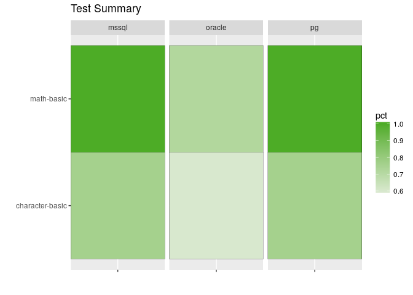
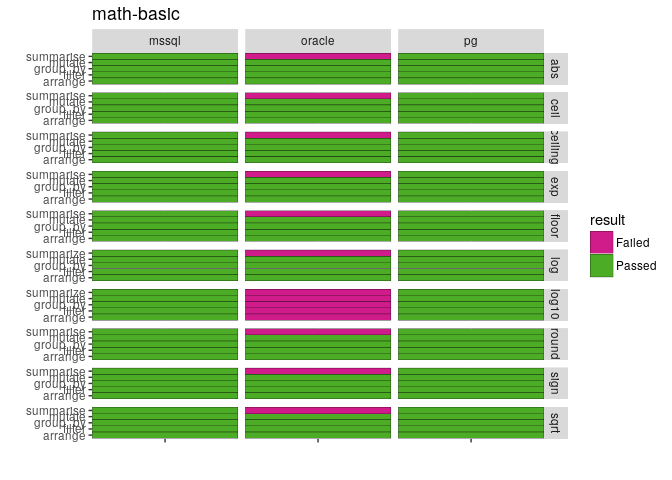
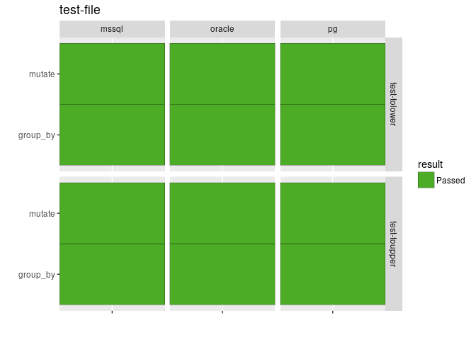

dbtest
================

[](https://travis-ci.org/rstudio/dbtest) [](https://codecov.io/github/rstudio/dbtest?branch=master)

Overview
========

`dbtest` uses `testthat` to automate testing of `dbplyr` translations by running the tests against live database connections. Tests are written in YAML files, and connections are either passed explicitly, read from system DSNs, or configured in YAML files. Further, it is possible to execute a test suite against multiple database connections.

Install
=======

To install `dbtest`, you can install the latest version from GitHub:

``` r
devtools::install_github("rstudio/dbtest")
```

Connection
==========

The first step to use `dbtest` is to set up a [DBI](http://dbi.r-dbi.org/) connection object. There are many ways you can do this.

### DSN

Sometimes, a system already has a handful of DSNs (Data Source Names) set up that make connection easy. In usual DBI, the connection might look like `DBI::dbConnect(odbc::odbc(), "My Data Source")`. On a linux operating system, these are usually defined in `/etc/odbc.ini` or `~/.odbc.ini`. If you have DSNs defined on your system, you can utilize them by using the value `"dsn"` as your connection. `dbtest` will use all of your DSNs and execute tests against them.

``` r
dbtest::test_database("dsn")
```

### YAML File

Every database has different connection parameters. To make database connections easy to automate, `dbtest` will read a YAML file and pass the named parameters into `dbConnect` to create a DBI connection. Note that the [`config`](https://github.com/rstudio/config) package is used, so you must label the set of connections and refer to it with `R_CONFIG_ACTIVE=mylabel`. Otherwise, the `default` heading will be selected. An example might look like:

``` yaml
default:
  pg:
    drv: !expr odbc::odbc()
    Driver: PostgreSQL
    Host: postgres.example.com
    Port: 5432
    Database: postgres
    UID: user
    PWD: password

  mssql:
    drv: !expr odbc::odbc()
    Driver: SQLServer
    Server: mssql.example.com
    Port: 1433
    UID: user
    PWD: password

  oracle:
    drv: !expr odbc::odbc()
    Driver: Oracle
    Host: oracle.example.com
    Port: 1521
    SVC: xe
    UID: user
    PWD: password
```

Notice that the names of the various databases are different. This corresponds to the parameters that different database providers expect in the `dbConnect` function. Notice also that `drv` is `!expr odbc::odbc()`. This allows execution of R code to provide the necessary DBI driver to support the connection.

You can test this behavior and create connection objects manually with:

``` r
cfg <- config::get(file = "./path/to/conn.yml")
do.call(dbConnect, cfg$pg)
do.call(dbConnect, cfg$mssql)
do.call(dbConnect, cfg$oracle)
```

Or you can use the config file and `dbtest` to execute tests against all of these database connections with:

``` r
dbtest::test_database("./path/to/conn.yml")
```

### DBI Connection

The most straightforward way to interactively use `dbtest` is to provide a DBI connection object directly to `dbtest::test_database`.

``` r
con <- DBI::dbConnect(odbc::odbc(), "My DSN")
dbtest::test_database(con)
```

### tbl\_sql

If you are familiar with `dbplyr` and already have a `tbl_sql` object (which combines a DBI connection object with a reference to a database table), you can pass that object to `test_database` as well. In this case, tests will be executed directly against that `tbl_sql` object.

``` r
con <- DBI::dbConnect(odbc::odbc(), "PostgreSQL")
dbWriteTable(con, "mytesttable", iris)
my_tbl_sql <- dplyr::tbl(con, "mytesttable")
dbtest::test_database(my_tbl_sql)
dbDisconnect(con)
```

Usage
=====

Once you have decided how you are going to provide connection objects to `dbtest`, the usage is fairly straightforward. You use `test_database`. `test_database` is also vectorized to make it easier for testing multiple databases.

`test_database` takes the following arguments:

-   datasource = a data source object used for connecting to a database (as described above)
-   tests = a list or character vector of YAML files from which tests will be sourced. See the examples of test files below or the test files included with `dbtest` by executing `dbtest::all_tests()`

If you want to use specific test files included in `dbtest`, you can reference them explicitly with `dbtest::pkg_test("character-basic.yml")`, for instance. This is what we will do for ease of use.

Finally, `dbtest` provides reporting functions that make it easier to analyze and explore the results of your tests. This is where the rubber meets the road on improving the development process with a test suite that increases quality and ensures reliability.

``` r
test_output <- dbtest::test_database(
  "conn.yml", 
  dbtest::pkg_test(
    c("character-basic.yml", "math-basic.yml")
    )
  )
```

    ## ...............EEEEE.E.....................................................
    ## ...............EEEEE.E.....................................................
    ## ..E....E....E..EEEEE.EE....E....E....E....E....E....E....E....E..EEEEE..E..

``` r
dbtest::plot_summary(test_output)
```



``` r
dbtest::plot_tests(test_output)
```

    ## $`character-basic`


    ## 
    ## $`math-basic`



If you want to see more specific details about a failure, in particular, you can use `get_dbtest_detail`:

``` r
dbtest::get_dbtest_detail(test_output)
```

    ## # A tibble: 75 x 7
    ##    test          pg     pg_raw mssql mssql_raw oracle           oracle_raw
    ##    <chr>         <chr>  <list> <chr> <list>    <chr>            <list>    
    ##  1 mutate: tolo… succe… <list… succ… <list [1… success          <list [1]>
    ##  2 "filter: tol… succe… <list… succ… <list [1… success          <list [1]>
    ##  3 summarize: n… succe… <list… succ… <list [1… "nanodbc/nanodb… <list [1]>
    ##  4 group_by: to… succe… <list… succ… <list [1… success          <list [1]>
    ##  5 arrange: tol… succe… <list… succ… <list [1… success          <list [1]>
    ##  6 mutate: toup… succe… <list… succ… <list [1… success          <list [1]>
    ##  7 "filter: tou… succe… <list… succ… <list [1… success          <list [1]>
    ##  8 summarize: n… succe… <list… succ… <list [1… "nanodbc/nanodb… <list [1]>
    ##  9 group_by: to… succe… <list… succ… <list [1… success          <list [1]>
    ## 10 arrange: tou… succe… <list… succ… <list [1… success          <list [1]>
    ## # ... with 65 more rows

Writing Test Files
==================

Writing test files in YAML can be a bit strange, because what `dbtest` expects is text. For instance, do *not* use the `!expr` trick that the `config` package uses above for a connection object. Rather, you specify a verb and then arbitrary text that will be interpreted as R code. This text will get picked up into the testing process, which will do the following:

-   ensure that test data is set up properly. On most connections, this will result in a temporary table.
-   build a `dplyr` chain focused on the verb you selected
-   insert your arbitrary text into the selected verb
-   execute the `dplyr` chain against the database
-   execute the `dplyr` chain against a local copy of the same data
-   compare the outputs using `testthat::expect_equal`

Currently supported verbs are:

-   summarise / summarize
-   mutate
-   arrange
-   filter
-   group\_by

Example
-------

An example might be most illustrative. Let's say that we want to test the base R functions `tolower` and `toupper` and how they get translated into SQL.

First, we would define a test YAML file like:

*/tmp/RtmpQ7gwyi/test-file.yml*
<pre>- test-tolower:<br>    mutate: tolower(fld_character)<br>    group_by: tolower(fld_character)<br>- test-toupper:<br>    mutate: toupper(fld_character)<br>    group_by: toupper(fld_character)</pre>
When executed against databases, it might look like:

``` r
test_results <- dbtest::test_database("conn.yml", test_file)
```

    ## ....
    ## ....
    ## ....

``` r
dbtest::plot_tests(test_results)[[1]]
```


